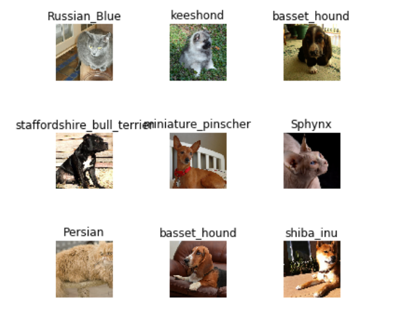
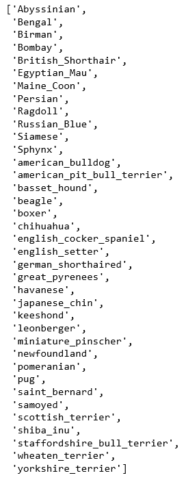
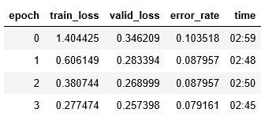
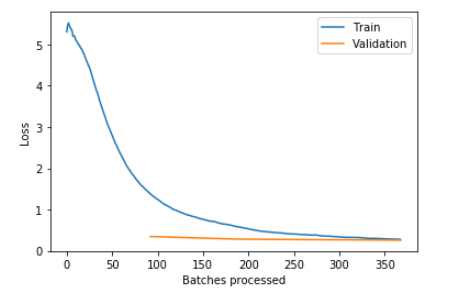
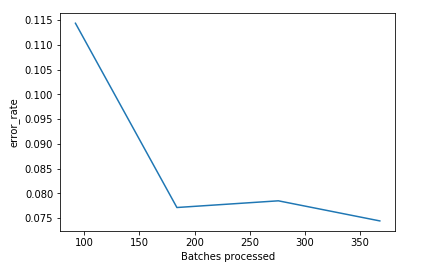
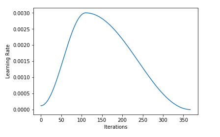
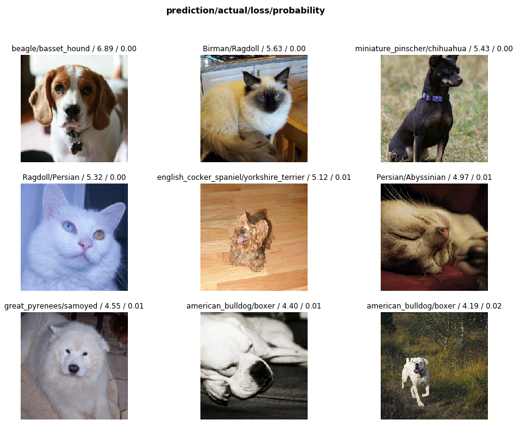
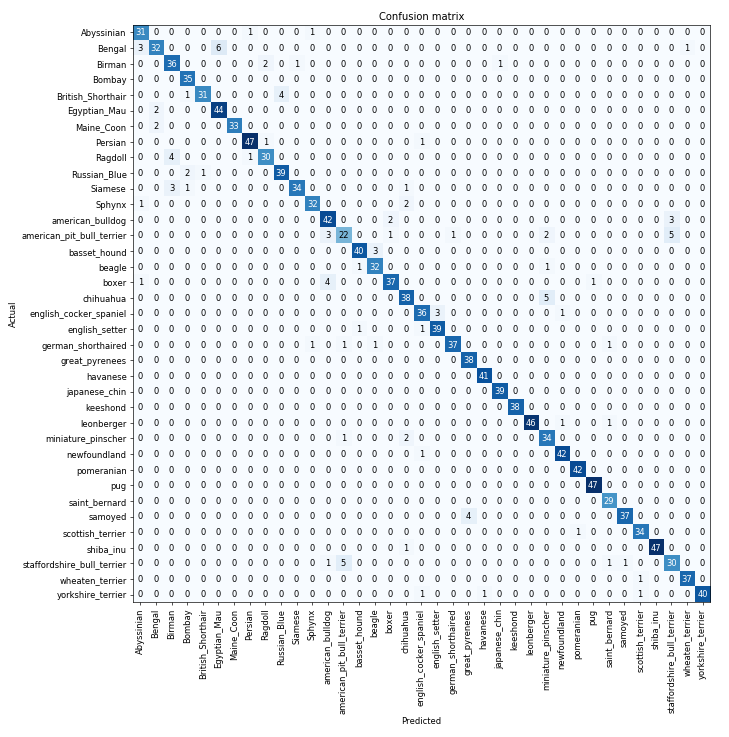
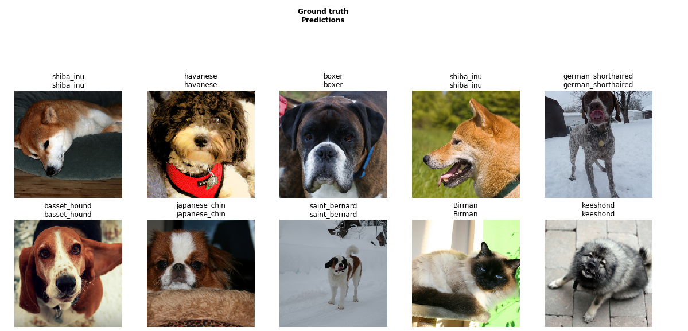
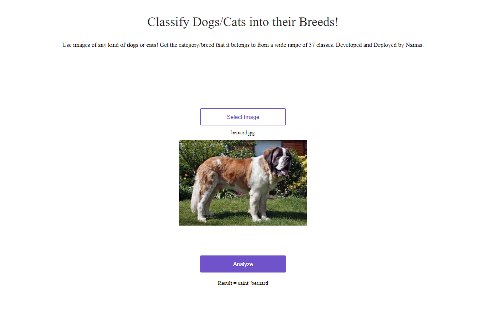

# Dog and Cat Breed Classification Using Transfer-Learning



Transfer learning is a research problem in machine learning that focuses on storing knowledge gained while solving one problem and applying it to a different but related problem. For example, knowledge gained while learning to recognize cars could apply when trying to recognize trucks.

I have used Transfer learning in order to train the ```ResNet 34``` CNN Model to predict the dog and cat breed using ```37``` different classes of cats and dogs. The model has been trained over ```4``` epochs only. 

The model has been deployed on render and you can try it out by visiting [this link](https://dogandcat-breed-classifier-by-namas.onrender.com/)

## Classes

The model has been trained on the PETS datasets which contains ```37``` classes that can be seen as follows:



## Training Metrics

The accuracy and error-rate for the training procedure can be seen as follows:



The loss-graph can be seen as follows:



The error rate can be seen as follows:



The learning rate can be seen as follows:



## Testing and Results

The classes that incurred the highest losses can be seen below. These are the classes which the network had a very high confidence of being true, however that didn't turn out to be the ground truth, experiencing the highest loss:



The confusion matrix for all the classes can be given below:



Few predictions from the model can be seen as below:




## Deployed Model

The model has been deployed on a cloud service called ```Render``` where people can test out the model by uploading the image and viewing the result.

Output:



## Contributing
Pull requests are welcome. For major changes, please open an issue first to discuss what you would like to change.

Please make sure to update tests as appropriate.

## License
[MIT](https://choosealicense.com/licenses/mit/)
